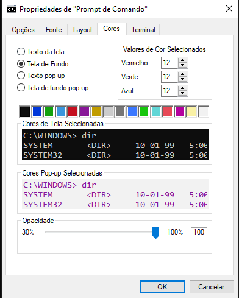
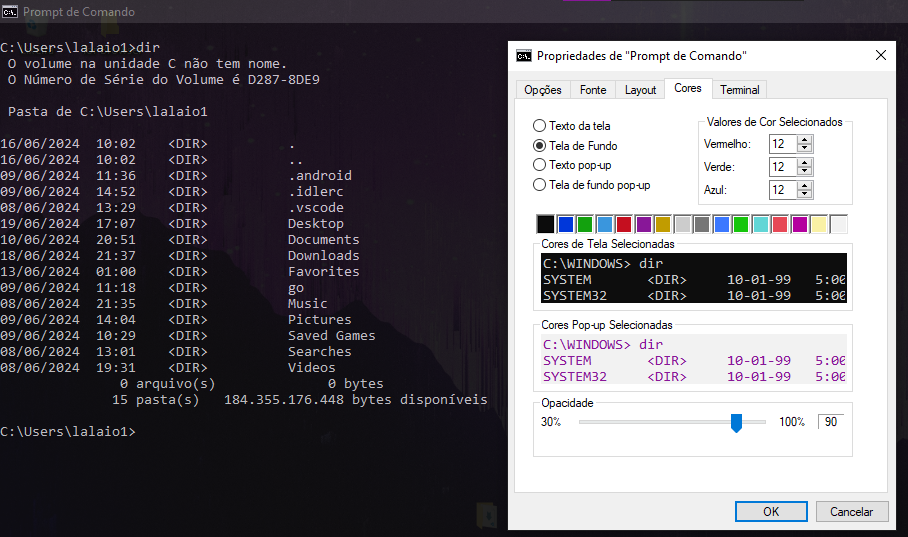
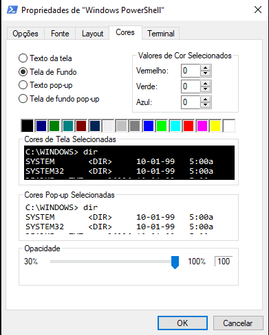
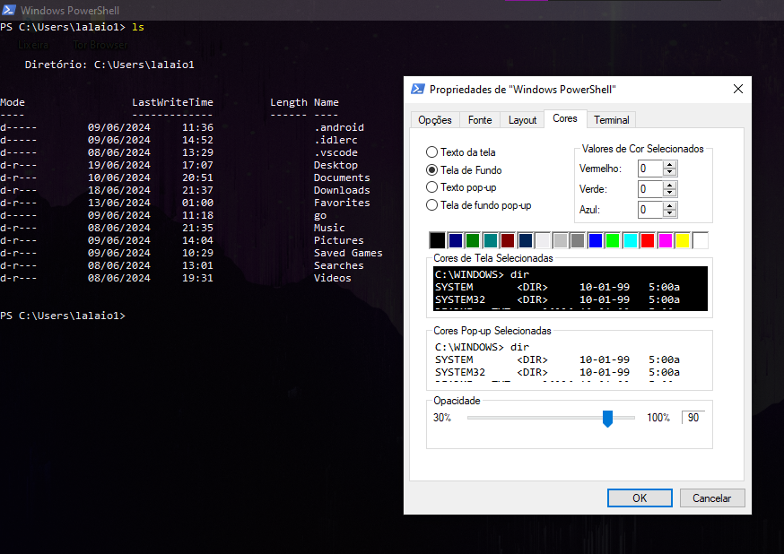
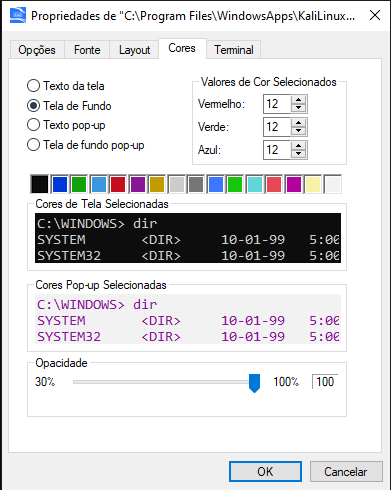
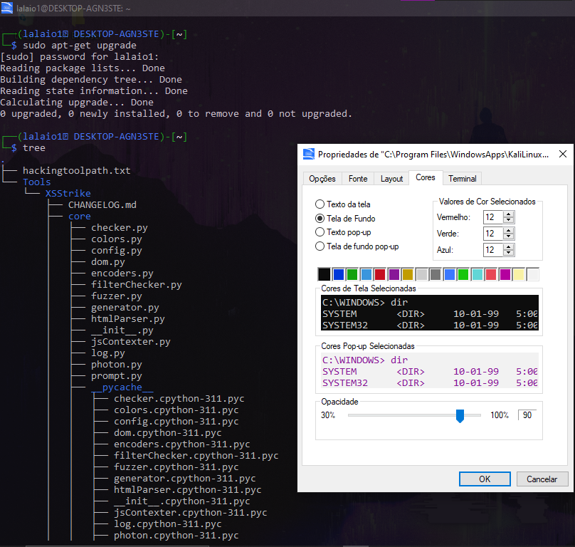

### 1. Mudando a Transparência do CMD

1. **Abra o CMD**:
   - Pressione `Win + R`, digite `cmd` e pressione `Enter`. 🖥️

2. **Acesse as Propriedades**:
   - Clique com o botão direito na barra de título do CMD e selecione `Propriedades`. ⚙️

     

3. **Ajuste a Transparência**:
   - Vá até a aba `Cores`.
   - Ajuste o controle deslizante em `Opacidade` para o nível desejado. 🎚️

     

4. **Clique em OK** para aplicar as mudanças. ✅

---

### 2. Mudando a Transparência do PowerShell

1. **Abra o PowerShell**:
   - Pressione `Win + R`, digite `powershell` e pressione `Enter`. 🖥️

2. **Acesse as Propriedades**:
   - Clique com o botão direito na barra de título do PowerShell e selecione `Propriedades`. ⚙️

     

3. **Ajuste a Transparência**:
   - Vá até a aba `Cores`.
   - Ajuste o controle deslizante em `Opacidade` para o nível desejado. 🎚️

     

4. **Clique em OK** para aplicar as mudanças. ✅

---

### 3. Mudando a Transparência do WSL

1. **Abra o WSL**:
   - Pressione `Win + R`, digite `wsl` e pressione `Enter`. 🖥️

2. **Acesse as Preferências**:
   - Clique com o botão direito na barra de título do WSL e selecione `Propriedades`. ⚙️

     

3. **Ajuste a Transparência**:
   - Vá até a aba `Cores`.
   - Ajuste o controle deslizante em `Opacidade` para o nível desejado. 🎚️

     

4. **Clique em OK** para aplicar as mudanças. ✅

---

### Observações Finais 📝

- 🛠️ **Permissões de Admin**: Para fazer essas alterações, você pode precisar de permissões de administrador.
- 💡 **Dica**: Alterar a opacidade para valores entre 70-80% geralmente oferece um bom equilíbrio entre transparência e legibilidade.
- 🔄 **Reinicie**: Às vezes, é necessário fechar e reabrir o terminal para ver as mudanças aplicadas. 🔄

---

### Créditos

Instruções por [lalaio1 (GitHub)](https://github.com/lalaio1) | Discord: lalaio1
